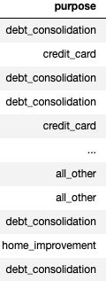
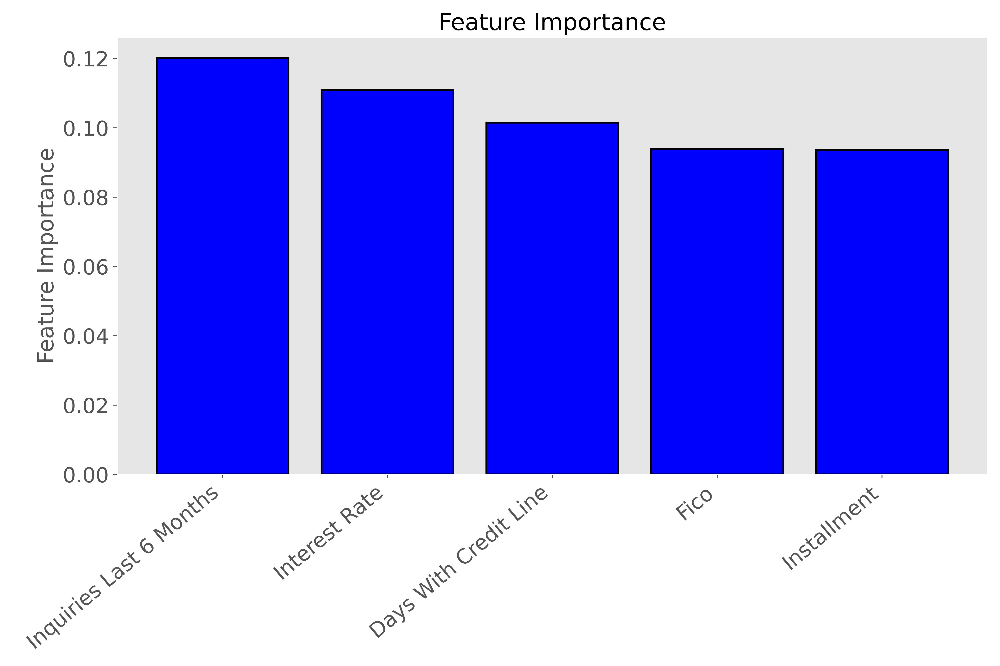
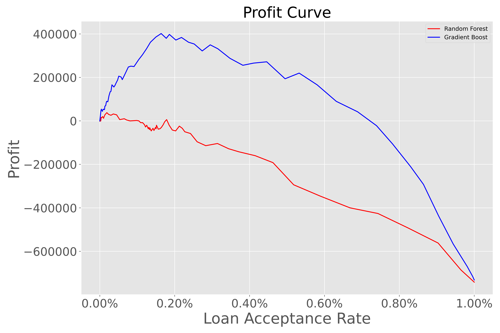

# Loan Risk Analysis Using Machine Learning

## The Goal
The goal of this project is to create a tool that allows bankers to maximize profit. In order to do that, I'll be using historic bank data provided by the [lendingclub.com](lendingclub.com) that contains non-identifying attributes about bank accounts and whether or not they repaid a loan in full. Once the data is prepared and cleaned, I will apply multiple machine learning models to the set and evaluate each model for its ability to maximize profit and recall score. 

## Background & Motivation
As a recent graduate from the University of New Hampshire with a degree in economics and a soon to be graduate of the Galvanize Data Science Immersive program I wanted to do a project that allows for the combinations of these areas of study. The [U.S. Department of Education](https://www.ed.gov/) reported that 20% of current borrowers are in default on their loan, default defined as having gone at least 270 days without a payment. While Standard and Poor (S&P) reports that "The world's banks are set to write off $2.1 trillion over the next years as customers are expected to default on loans because of the current Covid-19 pandemic". 

We are in the midst of a global pandemic because of the Covid-19 virus. The virus itself has brought on significant challenges for every industry and poses major health risks for the global population. Alongside these threats, Covid-19 has brought along challenging economic times and instances for many. Credit loan officers need to be aware of the risks and benefits involved with lending to new customers more than ever. With this, I wanted to see if I could create a tool that allows a banker to better understand a potential new customer and the profit/risk involved.  

## The data

The [data](https://www.kaggle.com/sarahvch/predicting-who-pays-back-loans) for this project is hosted by the popular competitive computer science website [Kaggle](https://www.kaggle.com/). The lendingclub was generous enough to provide the data to Kaggle for open access to the public. 

The set contains roughly 9800 unique bank accounts with 13 non-identifying attributes describing the account. These attributes include things such as FICO scores, purpose of loan, installment, and interest rate to name a few. At the end of these attributes the last one is a target attribute to whether or not the account paid back the loan in full. 

Here's a look at each one of those attributes:

| Credit Policy     | 1 if the customer meets the credit underwriting criteria of LendingClub.com, and 0 otherwise.                                                                                    |
|-------------------|----------------------------------------------------------------------------------------------------------------------------------------------------------------------------------|
| Int_rate          | The interest rate of the loan, as a proportion (a rate of 11% would be stored as 0.11). Borrowers judged by LendingClub.com to be more risky are assigned higher interest rates. |
| Installment       | The monthly installments owed by the borrower if the loan is funded.                                                                                                             |
| Log_annual_inc    | The natural log of the self-reported annual income of the borrower.                                                                                                              |
| Dti               | The debt-to-income ratio of the borrower (amount of debt divided by annual income).                                                                                              |
| Fico              | The FICO credit score of the borrower.                                                                                                                                           |
| Days_with_cr_line | The number of days the borrower has had a credit line.                                                                                                                           |
| Revol_bal         | The borrower's revolving balance (amount unpaid at the end of the credit card billing cycle).                                                                                    |
| Revol_util        | The borrower's revolving line utilization rate (the amount of the credit line used relative to total credit available).                                                          |
| Inq_last_6mths    | The borrower's number of inquiries by creditors in the last 6 months.                                                                                                            |
| Deling_2yrs       | The number of times the borrower had been 30+ days past due on a payment in the past 2 years.                                                                                    |
| Pub_rec           | The borrower's number of derogatory public records (bankruptcy filings, tax liens, or judgments).                                                                                |
| Unpaid            | 1 or 0 depending on if the borrower paid the loan off in full. 1 = unpaid, 0 = paid                                                                                              |
|                   |                                                                                                                                                                                  |
|                   |                                                                                                                                                                                  |

## Exploratory Data Analysis
To begin exploring my data I wanted to be 100% positive on my data and my base knowledge around loans. In order to do this I explored each attribute and how it was distributed between paying customers and non-paying customers. But, first I looked at my target variable and the distribution of classes inside it. 

In order to get into my data I needed to first deal with my purpose category. 

This attribute contained categorical values that in the future, would present problems when it came to modeling. In order to handle this, I one-hot encoded each unique category into its own new attribute of the bank account with an associated binary value. 

Now with that one hot encoding out of the way, I was ready to get deeper into my data. Just as I expected there was a large class imbalance between my two classes. This matter will be handled appropriately later on. Now looking at some of the more interesting attributes of the data and seeing how it stacks up in our target variable class. 

This graph outlines the FICO scores for both paid and unpaid customers. You can see on the bottom how customers who failed to pay back their loan generally had higher FICO scores than customers who fully paid off loans. 

Another variable I explored was the installment in the target variable. Installment outlines how much month-to-month the customer is expected to pay on their loan. Before viewing the data, I anticipated to see a significantly higher installment rate on the unpaid customers. 

As shown above, there ended up being a difference in the target variable with unpaid customers overall looking at higher installment payments month to month. 

## Balancing Classes
As previously shown in my target variable (unpaid) there are two classes defining whether or not a customer paid off their loan. These two classes have a major difference between the two, which when applying machine learning to my data, can pose problems. In order to negate these problems I chose to undersample my target variable so the two classes would be more equal. 

## Modeling
For this project I explored both a random forest and a gradient boost model. A random forest is an ensemble learning method for classification, regression, and other tasks that operate by constructing a multitude of decision trees at training time and outputting the class that is the mode of the classes or mean/average prediction of the individual trees (Wikipedia). Gradient boosting is a machine learning technique for regression and classification problems, which produces a prediction model in the form of an ensemble of weak prediction models, typically decision trees.

The goal for my model was to focus on my precision score, as I didn't want to predict a loan going into default even though it didn't which would result in a loss of profit. 

### Random Forest Model

The first model I decided to apply was the random forest technique. This model performed well with an accuracy score of 81%.

Taking a look at the feature importance of this model gives us:

Our top feature here happens to be installment which we took a look at earlier followed by Revol_util or the borrower's revolving line utilization rate (the amount of the credit line used relative to total credit available).

### Gradient Boost Model
The second model I applied was a gradient boosting model. After hypertuning using RandomizedSearchCV I was able to apply the optimal parameters and return an accuracy score of 85% and precision of 51%.

Once again let's look at the features involved behind this model: 

Above we can see similar features to the random forest model but some new ones as well. Our top feature for this model was inquiries in the last 6 months which outlines how many times the customer inquired about a loan from a loan officer. 

 The gradient boosted model was chosen for its overall scores and performance and is what is applied when looking at maximizing profit in the next section. 

### Profit Curve (using Gradient boost)

In order to assign a monetary value to this project I needed to make some assumptions on loans. The assumptions used in order to calculate profit are the following: 

* Average loan paid off in 8 years with an interest rate of 7%
* If a loan happens to default, it defaults roughly at 4 years
* It costs the company $8000 when a customer defaults
* The company gains $2000 when a customer fully pays off a loan 

With these assumptions I am able to calculate potential profit seen below. 

From this graph, you can see first, that the gradient boost model far out performs our random forest. Next we can see an optimal loan acceptance rate of 17%. At this rate we can expect to see the highest rate of profit. 

### Conclusions and Recommendations

In conclusion, my gradient boosted model performed the best on my data set. Having applied that model to a profit curve, we were able to see a significant profit increase of about $133,000 annually. 

Some predictions based of my findings are the following:

* If the loan is for a small business:
    - Ensure inquiries < 3 (results in 38% drop in unpaid customers)
    - FICO score > 700 (54% drop in unpaid customers)
* If the loan is a student loan for education
    - Ensure FICO score > 700 (43% drop in unpaid customers)

